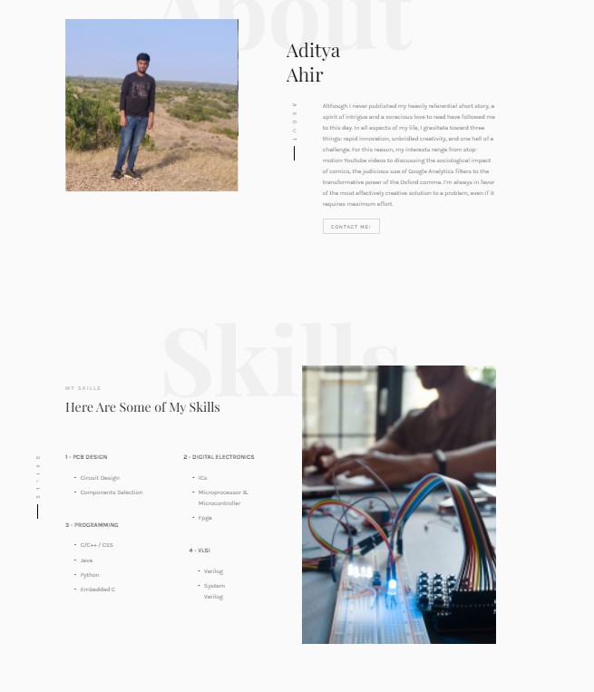
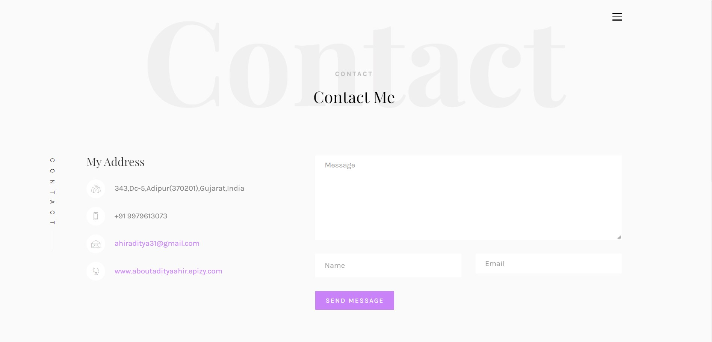

## 
 Personal portfolio website 

* It is my personal portfolio website made using **HTML**, **CSS** and **Boostrap**.
* This website will reflect my whole journey till now.
* It have Different section like **Home**, **About**, **Experience** and **Contact**.

_________________

## Home Page

Home page have my image and brief description about me.

_________________

## About Page

About page detailed description about me and my education journey.

_________________

## Experience  Page

Experience page shows my different skills , projects, internship etc.

_________________

## Contact Page

Contact Page contains the various social media platform link that i use.
You will also find different ways to contact with me.

_________________

**Author**

Aditya Ahir

_________________

**Thank you**
